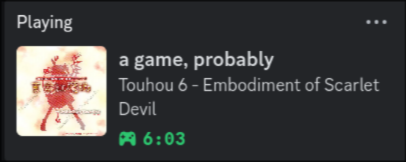

# Custom App Rich Presence

Some games have Rich Presences in Discord, but not all games have support for it (not being detected by default, no image/icon, etc...). This program allows you to create your own rich presence entries for all applications based on their process name.

Unfortunately, unless you want to create a new Discord application for each entry, you will have to settle for a generic name for the presence name. The custom text you give for each app is displayed in the details and state, as shown below.

# Installation

I mean I guess you could just clone and compile it yourself if you really want to use this so badly, though I'm not sure why you'd really want or need this but I'll make some real instructions later ¯\\\_(ツ)\_/¯

# Usage

You can start the program just by using `carp`, though it doesn't do much if you don't have anything configured.

If you don't want to have a console window constantly running, you could use `carp & disown` on Linux. I'm not really sure about Windows anymore because I don't use it but I'll figure out a better way to run it in the background.

# Configuration

carp needs to be configured to use a Discord application and detect at least one process before it can do anything. You can configure carp using the `carp config` subcommands, just use the `-h` flag to find out what the subcommand and its arguments do.

For images, you can use your own Discord application and upload assets, accessing said assets by just typing in the asset key. You can also use a link to an image, as well as GIFs. Images must be at least 512x512 in size, though 1024x1024 is recommended.

Feel free to use the id `1283571873522782302` for your client id. It has no assets and is named "a game, probably", so your status will appear as "Playing **a game, probably**". You can also create and name your own Discord application at https://discord.com/developers/applications.

Note that carp uses the order of processes in the target list and prioritizes programs that are higher up on the list when choosing what program to display.

carp also automatically splits any long names into two lines, although too many wide characters may result in the split partially failing and some text on the first line being truncated. Any text on the second line that is too large to fit will also be truncated.
